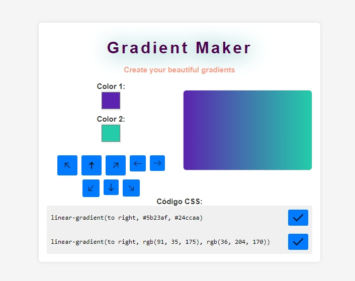

# Gradient Creator

## Preview

Here’s a quick preview of the application:



Gradient Creator is an interactive application to generate beautiful custom gradients using user-selected colors and directions. This project allows users to visualize the gradient in real-time and copy the CSS code in different formats.

## 🚀 Features

- Generate gradients with two customizable colors.
- Change the gradient direction using interactive buttons (e.g., right, left, diagonal).
- Copy the CSS code of the gradient in hexadecimal or RGB format.
- **Responsive Design:** Fully optimized for mobile, tablet, and desktop devices.
- Modern and user-friendly interface.

## 🛠️ Technologies Used

- **React**: JavaScript library for building user interfaces.
- **CSS**: Fully responsive design.
- **JavaScript**: Functional logic for handling colors, directions, and copying the code.
- **HTML**: Basic structure of the project.

## 📦 Installation

Follow these steps to clone and install the project locally:

1. Clone the repository:
   ```bash
   git clone https://github.com/xcaim04/Gradient-Creator.git

2. Navigate to the project directory:
    ```bash
    cd Gradient-Creator

3. Install the dependencies:
    ```bash
    npm install